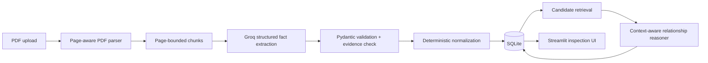

# Architecture

The pipeline persists each document, page-bounded chunk, fact, and relationship separately. Later uploads are incremental: only newly extracted facts are compared against existing facts.
